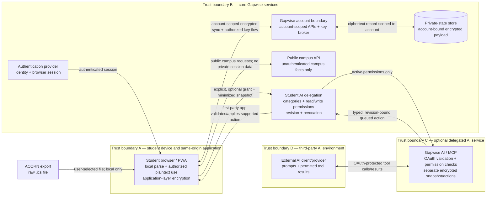

import { Aside } from '@astrojs/starlight/components';

**Diagram status:** implementation-backed public review view · **Reviewed:** 2026-08-28

This diagram shows data categories and authorization boundaries, not deployment topology or exploit-relevant detail. Read it with the [Security overview](/platform/security/) and [Privacy](/platform/privacy/).

<Aside type="caution" title="What the encryption boundary means">
The private-state store receives an account-bound encrypted payload, but this is **not** an end-to-end or zero-knowledge architecture. The browser, same-origin application code, authenticated core service/key broker, and authorized runtime remain relevant trust boundaries. Malicious same-origin JavaScript could access data available to the running application.
</Aside>

## Flow register

| Flow | Data | Control and purpose | Evidence class |
| --- | --- | --- | --- |
| ACORN export → browser | Raw `.ics` selected by the student | Parsed locally; no ACORN password requested; original file excluded from public API and AI delegation | **Implementation-verified** |
| Browser ↔ public API | Campus buildings, places, routes, caller-supplied gap interval | Public, unauthenticated contract; no account/session lookup or private timetable retrieval | **Implementation-verified** |
| Browser ↔ core account boundary | Session context, account metadata, encrypted private-state payload, authorized key flow | Authenticated account binding; transport security; browser-side application-layer encryption for supported sync state | **Implementation-verified** |
| Core boundary ↔ private-state store | Account ownership metadata and encrypted payload | Account scoping and database authorization policies; privileged paths remain server-side | **Implementation-verified**; production parity **confirmation required** |
| Browser → AI delegation | Permission selection and minimized derived snapshot | Optional explicit grant; excludes raw `.ics`, friends, precise/live location, session tokens, core encryption keys, and unrelated browser state | **Implementation-verified** |
| AI client/provider ↔ MCP | OAuth credential; permitted tool arguments/results | OAuth audience validation plus active fine-grained delegation; least-authority tool schemas | **Implementation-verified** |
| MCP → first-party app | Typed gap-preference action with expected revision | Queued, not direct canonical mutation; read-only imported academic meetings; revocable authority | **Implementation-verified** |
| Runtime → operational logs | Minimized diagnostic/security metadata | No credentials, auth artifacts, encryption material, or unnecessary private content is the handling expectation | **Process commitment**; destinations/retention **confirmation required** |

## Reviewer boundary notes

### A. Student device and same-origin code

The raw import is local, and the browser performs encryption/decryption needed by product features. Local processing reduces collection; it does not make all code executing in the application origin untrusted or harmless. Browser extensions, device compromise, dependency compromise, and malicious same-origin code remain relevant threats.

### B. Core Gapwise services

Authentication establishes the user context; private operations and stored records are account-bound. The key broker is intentionally shown inside the core boundary because authorized release is part of normal application operation. Public campus endpoints are logically separated and do not gain private access merely because they share the Gapwise product family.

### C. Optional Gapwise AI

AI delegation is not automatic on sign-in. OAuth protects the MCP resource, while the student's separate grant limits categories and actions. Gapwise AI can process authorized plaintext transiently and encrypts its own persisted snapshot/actions in a separate domain. Revocation removes delegated data/actions and later access fails closed.

### D. External AI environment

The chosen AI client/provider can process prompts and tool results that the student makes available. Its retention, training, workspace administration, residency, and deletion terms are a separate third-party boundary and require provider-specific review.

## Data deliberately absent from selected flows

- The public API receives no raw timetable upload, account session, private sync state, friend graph, or live-location history.
- The AI snapshot receives no raw ACORN file, friend/overlap data, precise/live location, Supabase access/refresh token, primary private-state encryption key, unrestricted database credential, or unrelated browser state.
- MCP tools do not accept arbitrary SQL, JavaScript, URLs, graph nodes, or a generic execute instruction.
- Imported academic meetings cannot be created, edited, or deleted through the live AI tool surface.

## Evidence and review limits

The flows are reconciled with the public [private-cloud architecture record](https://github.com/GapwiseHQ/gapwise/blob/main/docs/architecture/private-cloud.md), [core security policy](https://github.com/GapwiseHQ/gapwise/blob/main/SECURITY.md), [AI privacy model](https://github.com/GapwiseHQ/ai/blob/main/docs/PRIVACY.md), [AI threat model](https://github.com/GapwiseHQ/ai/blob/main/docs/THREAT_MODEL.md), and the [CI-checked live MCP manifest](https://github.com/GapwiseHQ/docs/blob/main/contracts/mcp-live-surface.json).

Source-backed review is not independent validation. Provider configuration, residency, retention, backup/recovery, production access membership, incident readiness, and any independent test results still require current human/provider evidence. No certification, audit result, penetration-test result, uptime level, or university approval is implied.
